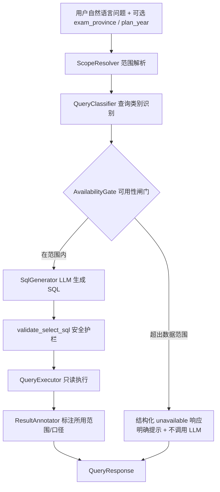

# Design Document

## Overview

本设计文档描述 **Query Catalog（查询目录）** 如何落地为 Gaokao RAG Lab 查询服务的一项能力。Query Catalog 不是一个独立的新服务，而是把 `requirements.md` 中定义的 15 类用户查询需求，映射到既有的 NL2SQL 链路（`packages/nl2sql/gaokao_nl2sql`）、数据库 schema（`packages/schema`）与 FastAPI 查询接口（`apps/api`）之上，并补齐两项关键能力：

1. **参数化范围（Scope Resolution）**：所有查询都可按 `exam_province`（考试/招生省份）与 `plan_year`（招生年份）参数化，即使当前实际数据仅覆盖贵州（贵州）与 2025。
2. **诚实的数据可用性反馈（Honest Availability Gating）**：对超出当前数据范围（省份、年份、缺失指标、跨年度趋势、政策类问题）的请求，系统必须明确返回“数据暂不可用”，禁止虚构数值或结论。

设计的核心取舍是：**把“能不能答”的判断从 LLM 手中前移到一个确定性的、可测试的范围闸门（Scope Gate）**。LLM 负责把“能答”的问题翻译成 SQL，但“是否在当前数据范围内”这一安全关键判断不交给 LLM，而由确定性代码完成，从而保证诚实反馈这一非功能需求（Requirement 15）在所有查询类别中都成立。

### 设计目标与非目标

**目标：**

- 为 15 类查询建立一份从需求到实现的映射，明确每类查询所依赖的表、列与可用性状态。
- 引入确定性的范围解析与可用性闸门，保证诚实反馈。
- 复用现有 NL2SQL 安全护栏（单条只读 SELECT、禁止写操作、强制 LIMIT、只读事务、statement_timeout）。

**非目标：**

- 不实现跨年度趋势（仅单年 2025）、录取均分、985/211、录取概率模型、政策 RAG 检索等当前数据/能力缺失的功能；这些类别仅需返回明确的“暂不可用”提示。
- 不修改既有数据库 DDL，不引入新的事实数据。
- 不在本设计内定义具体 SQL 语句文本（需求文档只定义业务级验收）。

## Architecture

### 当前链路与扩展点

现有 NL2SQL 链路是一条三段式流水线：

```text
question --> SqlGenerator(LLM) --> validate_select_sql(Guard) --> QueryExecutor(只读) --> rows
```

Query Catalog 在这条链路前后各插入一层，但**不改变**既有三段的内部逻辑：



关键架构决策：

- **闸门前置、LLM 在后**：`AvailabilityGate` 在调用 LLM 之前判定请求是否在当前数据范围内。超范围请求直接短路为结构化的 `unavailable` 响应，根本不进入 SQL 生成，从源头杜绝虚构。
- **范围注入而非依赖 LLM 自觉**：`exam_province` 与 `plan_year` 由 `ScopeResolver` 解析为确定值（缺省时用默认范围），并通过 schema 上下文与结果标注体现，而不是寄希望于 LLM 记住“只有贵州 2025”。
- **复用安全护栏**：所有进入 SQL 执行的语句仍由现有 `validate_select_sql` 校验，保持单条只读 SELECT 的纵深防御不变。
- **结果标注**：`ResultAnnotator` 在返回结果时附带实际采用的 `exam_province`、`plan_year`、`subject_category` 等口径，满足多条需求中“结果中标明所用口径”的验收。

### 查询类别到链路的映射

| 需求 | 查询类别 | 可用性 | 主要数据来源 | 链路走向 |
| --- | --- | --- | --- | --- |
| R1 | 学校查询 | 可直接实现 | `staging.admission_records` + `school` | 闸门通过 → LLM → 执行 |
| R2 | 专业查询 | 部分需计划目录 | `staging.admission_records` | 部分字段闸门标注“需计划目录数据” |
| R3 | 分数/位次筛选 | 可直接实现 | `staging.admission_records` | 闸门通过 → LLM → 执行 |
| R4 | 对比查询 | 可直接实现 | `staging.admission_records` | 闸门通过 → LLM → 执行 |
| R5 | 趋势查询 | 需多年数据 | —（单年） | 闸门短路 → unavailable |
| R6 | 统计/排名 | 可直接实现 | `staging.admission_records` | 闸门通过；录取均分/录取人数项短路 unavailable |
| R7 | 位次↔分数换算 | 可直接实现 | `staging.score_segments` | 闸门通过 → LLM/换算 → 执行 |
| R8 | 招生计划查询 | 需计划目录数据 | `staging.admission_records`（部分） | 部分字段闸门标注 unavailable |
| R9 | 选科要求查询 | 可直接实现 | `staging.admission_records.selection_requirements` | 闸门通过 → LLM → 执行 |
| R10 | 专项/特殊招生 | 可直接实现 | `staging.admission_records.admission_program` | 闸门通过 → LLM → 执行 |
| R11 | 多条件组合筛选 | 可直接实现 | `staging.admission_records` + `school` | 闸门通过；引用缺失指标的条件短路标注 |
| R12 | 地域查询 | 可直接实现 | `school`（province_id/city） | 闸门通过 → LLM → 执行 |
| R13 | 录取概率（冲稳保） | 部分需后续模型 | `staging.admission_records` | 返回基于位次的参考评估 + 非概率模型标注 |
| R14 | 解释/政策类 | RAG 后续 | —（政策文档未入库） | 闸门短路 → unavailable |
| R15 | 诚实反馈（非功能） | 适用全部 | — | 横切：所有类别共享闸门与标注 |

## Components and Interfaces

设计新增的组件均为纯逻辑组件，置于 `gaokao_nl2sql` 包内或其上层，可独立单测且不依赖 LLM 与数据库。

### ScopeResolver（范围解析器）

职责：把用户可选提供的 `exam_province` / `plan_year` 解析为本次查询实际采用的范围；缺省时回落到默认范围并在响应中标明（R1.3、R15.4）。

```python
@dataclass(frozen=True)
class QueryScope:
    exam_province: str          # 实际采用的考试/招生省份
    plan_year: int              # 实际采用的招生年份
    used_default_province: bool # 是否使用了默认省份
    used_default_year: bool     # 是否使用了默认年份

class ScopeResolver:
    DEFAULT_PROVINCE = "贵州"
    DEFAULT_YEAR = 2025

    def resolve(
        self,
        exam_province: str | None,
        plan_year: int | None,
    ) -> QueryScope: ...
```

### DataScopeRegistry（数据范围登记表）

职责：作为“当前哪些 (省份, 年份) 有数据、哪些指标可用”的单一事实来源。它是确定性的配置数据，闸门据此判断。

```python
@dataclass(frozen=True)
class DataScope:
    available_provinces: frozenset[str]      # {"贵州"}
    available_years: frozenset[int]          # {2025}
    unavailable_metrics: frozenset[str]      # {"录取均分","admitted_count","985","211", ...}
    plan_catalog_loaded: bool                # 招生计划目录数据是否入库
    policy_rag_enabled: bool                 # 政策 RAG 能力是否可用
```

### QueryClassifier（查询类别识别器）

职责：把自然语言问题归类到 15 类之一（或“结构化数据查询”这一通用类），用于决定闸门策略（例如趋势类、政策类直接短路）。识别可基于关键词/意图标志位（如“趋势”“涨幅”“跨年”→ R5；“是什么”“规则”“政策”→ R14；“录取均分”“985”“211”→ 缺失指标）。

```python
class QueryCategory(Enum):
    SCHOOL = "school"; MAJOR = "major"; SCORE_RANK_FILTER = "score_rank_filter"
    COMPARE = "compare"; TREND = "trend"; STATS_RANK = "stats_rank"
    SCORE_RANK_CONVERT = "score_rank_convert"; ENROLLMENT_PLAN = "enrollment_plan"
    SELECTION_REQ = "selection_req"; SPECIAL_PROGRAM = "special_program"
    MULTI_FILTER = "multi_filter"; REGION = "region"; ADMISSION_PROBABILITY = "admission_probability"
    POLICY_EXPLAIN = "policy_explain"; GENERIC = "generic"

@dataclass(frozen=True)
class ClassifiedQuery:
    category: QueryCategory
    requested_metrics: frozenset[str]  # 问题中引用到的指标名（用于缺失指标检测）
```

### AvailabilityGate（可用性闸门）

职责：核心安全关键组件。给定 `QueryScope`、`ClassifiedQuery` 与 `DataScope`，判定请求是否在范围内；超范围则产出结构化的 `Unavailable` 决策（含明确原因与面向用户的提示），并阻止进入 LLM。

```python
class UnavailableReason(Enum):
    PROVINCE_OUT_OF_SCOPE = "province_out_of_scope"      # R15.1 / R15.2（混合省份整体拒绝）
    YEAR_OUT_OF_SCOPE = "year_out_of_scope"              # R15.3
    METRIC_UNAVAILABLE = "metric_unavailable"            # R15.4 / R6.4（指标即为请求输出时整体短路）
    TREND_NEEDS_MULTI_YEAR = "trend_needs_multi_year"    # R5.1 / R5.2 / R5.4
    PLAN_CATALOG_REQUIRED = "plan_catalog_required"      # R2.3 / R8.2
    POLICY_RAG_OUT_OF_SCOPE = "policy_rag_out_of_scope"  # R14.1
    PROBABILITY_MODEL_PENDING = "probability_model_pending"  # R13.3

@dataclass(frozen=True)
class GateDecision:
    allowed: bool
    reasons: tuple[UnavailableReason, ...]   # allowed=False 时非空
    message: str                              # 面向用户的明确提示（中文）

class AvailabilityGate:
    def evaluate(
        self, scope: QueryScope, query: ClassifiedQuery, data_scope: DataScope
    ) -> GateDecision: ...
```

闸门判定规则（确定性，按优先级）：

1. 请求中涉及的任一考试/招生省份 `∉ data_scope.available_provinces` → `PROVINCE_OUT_OF_SCOPE`。即当一个查询同时涉及受支持省份（贵州）与不受支持省份时，整条查询被拒绝（短路为不可用），不返回受支持省份的部分结果（R15.1、R15.2 拒绝整体查询）。**省份判定优先级最高**：当请求同时触发“省份超范围”与“缺失指标”时，按省份拒绝整条查询（R15.5）。
2. `scope.plan_year ∉ data_scope.available_years` → `YEAR_OUT_OF_SCOPE`（R15.3）。
3. `category == TREND` 且仅单年数据 → `TREND_NEEDS_MULTI_YEAR`（R5.1、R5.2、R5.4）。
4. `category == POLICY_EXPLAIN` 且 `not policy_rag_enabled` → `POLICY_RAG_OUT_OF_SCOPE`（R14.1）。
5. `category == ADMISSION_PROBABILITY` 且请求精确概率 → `PROBABILITY_MODEL_PENDING`（R13.3）。
6. **缺失指标的双重语义**（R6.4 vs R11.4）：
   - 当缺失指标是查询的**主要输出**（如“按录取均分排名”“实际录取人数统计”，category ∈ {STATS_RANK} 且 `requested_metrics ⊆ unavailable_metrics` 的核心项）→ `METRIC_UNAVAILABLE`，整条查询短路（R6.4、R15.4）。
   - 当缺失指标只是**多条件筛选中的一个过滤条件**（category == MULTI_FILTER，且仍存在其余可用条件）→ **不短路**：忽略该条件、基于其余条件继续执行，并由 `ResultAnnotator` 始终附加“该筛选指标当前无数据、已被忽略”的明确标注（R11.4，绝不静默忽略）。
7. 计划目录维度未入库且请求依赖它 → `PLAN_CATALOG_REQUIRED`（R8 整体不可用时短路；R2 部分字段时降级标注）。
8. 否则 `allowed = True`。

### ScoreRankConverter（位次↔分数换算）

职责：基于 `staging.score_segments` 实现分数→累计位次、位次→分数/分数区间的换算（R7）。这是纯函数逻辑，便于属性测试。

```python
@dataclass(frozen=True)
class ScoreSegment:
    score: float
    cumulative_count: int
    score_type: str
    subject_category: str | None

@dataclass(frozen=True)
class ConversionResult:
    score_type: str
    subject_category: str | None
    cumulative_rank: int | None      # 分数→位次
    score_or_range: tuple[float, float] | None  # 位次→分数区间
    out_of_range: bool               # R7.4

class ScoreRankConverter:
    def score_to_rank(self, segments: Sequence[ScoreSegment], score: float) -> ConversionResult: ...
    def rank_to_score(self, segments: Sequence[ScoreSegment], rank: int) -> ConversionResult: ...
```

换算口径：分数段按累计人数（含本段及以上）单调；分数越高累计位次越小。换算结果须标明 `score_type` 与 `subject_category`（R7.3）。

### ResultAnnotator（结果标注器）

职责：在成功执行后，给响应附加本次实际采用的口径（`exam_province`、`plan_year`、`subject_category`、批次），以及对部分不可用项的逐项标注（R1.3、R2.3、R4.2/4.3、R6.3、R7.3、R11.2/11.4）。

### CatalogPipeline（编排器）

职责：在现有 `Nl2SqlPipeline` 外再包一层编排：`ScopeResolver → QueryClassifier → AvailabilityGate →（短路 unavailable | 进入 Nl2SqlPipeline）→ ResultAnnotator`。现有 `Nl2SqlPipeline` 不变。

### API 接口扩展

`QueryRequest` 增加可选范围参数；`QueryResponse` 增加 `availability` 与 `scope` 标注字段，保持向后兼容。

```python
class QueryRequest(BaseModel):
    question: str = Field(..., min_length=1)
    exam_province: str | None = None
    plan_year: int | None = None

class AvailabilityInfo(BaseModel):
    available: bool
    reasons: list[str] = []
    message: str | None = None

class QueryResponse(BaseModel):
    question: str
    sql: str | None                 # unavailable 时为 None（未生成 SQL）
    row_count: int
    rows: list[dict[str, Any]]
    exam_province: str              # 实际采用的口径
    plan_year: int
    subject_category: str | None = None
    availability: AvailabilityInfo
    notes: list[str] = []           # 逐项可用性/口径标注
```

## Data Models

Query Catalog 不新增数据库表，完全复用既有 schema。各查询类别对表/列的依赖如下。

### 可用数据面（来自 schema_context 白名单）

- `staging.admission_records`：贵州 2025 投档事实。关键列 `exam_province`、`plan_year`、`school_name`、`source_school_name`、`major_name`、`batch`、`subject_category`、`admission_track`、`admission_program`、`selection_requirements`、`enrollment_plan_count`、`filing_count`、`admitted_count`（当前为空）、`min_score`、`min_rank`、`tuition`、`duration`。
- `staging.score_segments`：贵州 2025 一分一段/综合成绩分数段。关键列 `score`、`score_label`、`segment_count`、`cumulative_count`、`cumulative_ratio`、`score_type`、`subject_category`、`admission_track`。
- `school`：全国院校主数据。关键列 `name`、`province_id`（院校所在地）、`city`、`school_type`、`education_level`、`ownership`、`is_double_first_class`。
- `province`：省份主数据。

### 关键口径约束（直接来自 schema.md / etl-output-contract.md）

- **考试/招生省份 ≠ 院校所在地**：`admission_records.exam_province` 是招生数据发布省份（贵州）；`school.province_id` 是院校所在地。地域查询（R12）使用后者，范围参数化（R15.4）使用前者，二者不可混用（R12.3）。
- **投档人数 ≠ 录取人数**：`filing_count` 不等于实际录取人数；`admitted_count` 当前为空，属缺失指标（R6.4）。
- **位次优先**：跨院校/跨科类比较优先用 `min_rank`，其次 `min_score`（R3.2、R6.1）。
- **缺失指标集合**：录取均分、985、211、`admitted_count`（实际录取人数）、跨年度趋势，均不在当前数据中（R5、R6.4、R15.3）。

### 缺失/超范围指标登记（DataScope 初始值）

```text
available_provinces  = {"贵州"}
available_years      = {2025}
unavailable_metrics  = {"录取均分", "admitted_count", "实际录取人数", "985", "211"}
plan_catalog_loaded  = False    # R2.3 / R8.2 计划目录维度未入库
policy_rag_enabled   = False    # R14 政策 RAG 未启用
```


## Correctness Properties

*属性（Property）是指在系统所有有效执行中都应成立的特征或行为——本质上是对“系统应当做什么”的形式化陈述。属性是人类可读规格与机器可验证正确性保证之间的桥梁。*

本节基于上面的验收标准预分析（prework）编写。预分析显示，大量验收标准属于具体渲染示例或空结果边界（适合用例/边界测试），而真正适合属性化测试的是 Query Catalog 的两类确定性纯逻辑：**可用性闸门 + 范围解析（诚实反馈）** 与 **位次↔分数换算**。下列属性已经过去冗余处理：多条“某类超范围请求返回不可用提示”（R5.1/5.2/5.4、R6.4、R13.3、R14.1、R15.1/15.2/15.3/15.4/15.5）共享同一条闸门逻辑，被合并为“闸门正确判定原因”（Property 2，含整体拒绝与省份优先级）与“被拒请求绝不虚构”（Property 3，R14.2/15.7）两条互补属性；R7.3 的标注要求并入换算属性（Property 5）；多条件筛选中缺失指标条件的“不静默忽略”（R11.4）与对比缺项守恒（R4.3）合并为部分可用守恒属性（Property 7）；范围解析与全类别参数化（R1.3、R15.6）合并为 Property 1。

属性测试均针对纯逻辑组件（ScopeResolver、AvailabilityGate、ScoreRankConverter、ResultAnnotator），通过 mock 的 `ChatModel` 与 `QueryExecutor` 隔离 LLM 与数据库，运行成本低，适合 100+ 次迭代。

### Property 1: 范围解析忠实回落并标注（全类别参数化）

*对任意* 查询类别、可选的 `exam_province`（含 None）与 `plan_year`（含 None）输入，`ScopeResolver` 解析出的 `QueryScope` 满足：未提供时回落到默认范围（贵州 / 2025）且对应 `used_default_*` 为真，已提供时原样采用且 `used_default_*` 为假；并且最终响应中标注的 `exam_province` 与 `plan_year` 恒等于实际采用的解析值。该解析对所有查询类别一致适用（参数化与类别无关）。

**Validates: Requirements 1.3, 15.6**

### Property 2: 闸门对超范围请求给出正确的不可用原因（含整体拒绝与优先级）

*对任意* 请求，若其解析省份不在可用省份集合、或年份不在可用年份集合、或被分类为趋势类（单年数据）、或被分类为政策解释类（RAG 未启用）、或请求精确录取概率、或其**主要输出指标**落在缺失指标集合中，则 `AvailabilityGate.evaluate` 返回 `allowed = False`，且 `reasons` 准确对应其超范围的成因（省份/年份/趋势/政策/概率模型/缺失指标）。特别地：当请求同时涉及受支持与不受支持省份时整条查询被拒绝（不返回部分结果）；当“省份超范围”与“缺失指标”同时成立时，`reasons` 必含 `PROVINCE_OUT_OF_SCOPE`（省份优先、整体拒绝）。

**Validates: Requirements 5.1, 5.2, 5.4, 6.4, 13.3, 14.1, 15.1, 15.2, 15.3, 15.4, 15.5**

### Property 3: 被拒请求绝不虚构数据

*对任意* 被闸门判定为 `allowed = False` 的请求，整条管线都不会调用 LLM（`ChatModel` 调用计数为 0）、不会执行 SQL，最终响应满足 `sql is None`、`rows == []`、`row_count == 0`，且 `availability.message` 为明确的中文不可用提示。这是诚实反馈的核心安全不变量：范围外请求绝不产出未经数据支撑的具体数值或结论。

**Validates: Requirements 14.2, 15.7**

### Property 4: 依赖招生计划目录的维度降级并显式标注

*对任意* 请求计划目录维度信息的查询，当 `DataScope.plan_catalog_loaded` 为假时，响应必定携带 `PLAN_CATALOG_REQUIRED` 对应的明确标注（“需招生计划目录数据，暂不可用”），而不会就该维度返回未经数据支撑的具体数值。

**Validates: Requirements 2.3, 8.2**

### Property 5: 位次↔分数换算的往返、边界与口径标注

*对任意* 一组按分数单调的有效分数段数据与一个落在覆盖范围内的分数，`score_to_rank` 返回的累计位次等于该分数所属段的 `cumulative_count`；且 `rank_to_score(score_to_rank(score))` 返回的分数区间包含原分数（非严格逆，落回同一段区间）；*对任意* 超出 `[min_score, max_score]` 覆盖范围的分数或位次输入，结果置 `out_of_range = True` 且不返回虚构换算值；所有换算结果都标明 `score_type` 与 `subject_category`。

**Validates: Requirements 7.1, 7.2, 7.3, 7.4, 3.4**

### Property 6: 查询响应忠实标注所采用的口径与条件

*对任意* 通过闸门的查询，最终响应标注的 `exam_province`、`plan_year`、`subject_category`/批次口径，以及（多条件筛选时）所应用的筛选条件集合，恒等于本次实际采用的范围与输入条件集合。

**Validates: Requirements 4.2, 11.2**

### Property 7: 部分可用时保留可用项并标注缺失项（含被忽略筛选条件）

*对任意* 对比或多条件组合筛选请求，其涉及的若干项（对比项或筛选条件）中部分在数据范围内、部分缺失/不可用时，响应在 `rows` 中保留全部命中项、在 `notes` 中逐项标注缺失或被忽略项，且“命中/已应用项数 + 缺失/被忽略标注项数”等于请求项总数（不丢项、不增项）。特别地，多条件筛选中任一引用缺失指标的条件被忽略时，必定产生明确的“该筛选指标当前无数据、已被忽略”标注，绝不静默忽略。

**Validates: Requirements 4.3, 11.4**

### Property 8: 缺少科类时口径被显式处理

*对任意* 提供了分数但未提供 `subject_category` 的筛选/换算请求，响应要么包含“需要 subject_category 以保证位次口径一致”的明确提示，要么在结果中标明所采用的科类；二者必居其一，不会在科类口径不明的情况下静默返回位次结论。

**Validates: Requirements 3.3**

### Property 9: 院校所在地与考试/招生省份始终分离

*对任意* 同时含地域条件与考试/招生省份范围的请求，地域筛选维度仅来源于 `school.province_id` / `school.city`，范围参数化维度仅来源于 `exam_province`；二者在解析与标注中相互独立，`exam_province` 的取值绝不写入地域筛选维度，反之亦然。

**Validates: Requirements 12.3**

### Property 10: 录取把握度参考单调且标注为非概率模型

*对任意* 院校最低位次与考生位次输入，基于位次差的把握度参考在“考生位次相对更优”（数值更小）时单调不降；且任意把握度评估结果都带有“基于单年位次的参考评估，非概率模型结果”的明确标注。

**Validates: Requirements 13.1, 13.2**

## Error Handling

错误处理遵循“确定性闸门优先、复用既有护栏、统一映射到 API 状态码”的原则。

### 范围外与不可用（业务级，非异常）

超出数据范围的请求**不是错误**，而是正常的业务结果。`AvailabilityGate` 产出 `GateDecision(allowed=False, ...)`，管线据此返回 HTTP 200 + `availability.available = False` + 明确中文提示（`message`）。该路径**不调用 LLM、不访问数据库**，从根本上避免虚构（R15.5）。各原因对应的提示文案：

| 原因 | 面向用户的提示（示例口径） |
| --- | --- |
| `PROVINCE_OUT_OF_SCOPE` | “该省份数据暂不可用（当前仅支持贵州）。” |
| `YEAR_OUT_OF_SCOPE` | “该年份数据暂不可用（当前仅支持 2025）。” |
| `METRIC_UNAVAILABLE` | “该指标数据暂不可用（如录取均分、985/211、实际录取人数）。”（仅当缺失指标为查询主要输出时整体短路；作为多条件筛选之一时改为忽略并标注，见下） |
| `TREND_NEEDS_MULTI_YEAR` | “跨年度趋势查询需多年数据，当前仅有单一年份，暂不可用。” |
| `PLAN_CATALOG_REQUIRED` | “该信息需招生计划目录数据，暂不可用。” |
| `POLICY_RAG_OUT_OF_SCOPE` | “政策与解释类查询由后续 RAG/政策文档检索能力支持，当前阶段不在范围内。” |
| `PROBABILITY_MODEL_PENDING` | “概率模型为后续增强能力，当前暂不可用。” |

### 空结果（边界，非异常）

闸门通过但查询命中 0 行时，返回 HTTP 200 + `rows = []` + 类别相应的“暂无数据”提示（R1.4、R2.4、R8.3、R9.3、R10.3、R11.3、R12.4）。`ResultAnnotator` 负责根据查询类别选择提示文案。

### 部分可用降级（多条件筛选，非异常）

当多条件筛选（R11.4）中某个条件引用了缺失指标，闸门**不**整体短路，而是忽略该条件、基于其余条件继续执行；`ResultAnnotator` 在 `notes` 中始终附加“该筛选指标当前无数据、已被忽略”的明确标注。只要存在被忽略的条件就必有对应标注，绝不静默忽略（与 Property 7 对应）。类似地，依赖招生计划目录的部分字段（R2.3）按维度降级标注而非整体短路。

### 技术异常（复用现有映射）

沿用 `apps/api/app/routers/query.py` 现有映射，不改变语义：

- `SqlGenerationError` → HTTP 502（LLM 生成失败）。
- `UnsafeSqlError` → HTTP 400（生成的 SQL 未通过安全护栏）。
- `SqlExecutionError` → HTTP 500（执行失败）。

新增组件（`ScopeResolver`、`QueryClassifier`、`AvailabilityGate`）为纯逻辑，输入非法（如 `plan_year` 非整数）由 Pydantic 在 API 边界校验为 HTTP 422。

### 安全护栏不变（纵深防御）

进入执行的 SQL 仍由 `validate_select_sql` 校验为单条只读 SELECT、禁止写/DDL 关键字、强制 LIMIT；执行层保持 READ ONLY 事务 + `statement_timeout` + 只读角色。Query Catalog 不削弱任何既有防御。

## Testing Strategy

采用单元测试与属性测试互补的双轨策略。属性测试覆盖确定性纯逻辑（闸门、范围解析、换算、标注），单元/边界测试覆盖具体渲染与空结果场景。

### 属性测试（Property-Based Testing）

- **库**：使用 Python 的 [Hypothesis](https://hypothesis.readthedocs.io/)（与既有 pytest 测试栈一致），不自行实现属性测试框架。
- **迭代次数**：每条属性测试至少运行 100 次迭代（`@settings(max_examples=100)` 或更高）。
- **隔离**：通过 mock 的 `ChatModel` 与 `QueryExecutor` 注入到 `CatalogPipeline`，使属性测试不依赖真实 LLM 与数据库；mock 的 `ChatModel` 记录调用次数以验证 Property 3（被拒请求 0 次调用）。
- **生成器**：构造省份（含贵州与随机非贵州）、年份（含 2025 与随机非 2025）、查询类别、引用指标集合、单调分数段序列、考生/院校位次等随机输入。
- **标签**：每条属性测试以注释标注对应设计属性，格式：
  `# Feature: query-catalog, Property {number}: {property_text}`
- **映射**：Property 1–10 各由**单条**属性测试实现：
  - Property 1 → ScopeResolver 范围解析与标注
  - Property 2 → AvailabilityGate 原因判定（表驱动随机成因）
  - Property 3 → 被拒请求不调用 LLM、无 SQL、无数据行
  - Property 4 → 计划目录维度降级标注
  - Property 5 → ScoreRankConverter 往返 + 边界 + 口径标注
  - Property 6 → ResultAnnotator 口径/条件标注
  - Property 7 → 部分可用时项数守恒与缺失标注
  - Property 8 → 缺科类时提示或标注
  - Property 9 → 院校所在地与考试省份分离
  - Property 10 → 把握度单调 + 非概率模型标注

### 单元测试（示例与边界）

针对具体渲染与空结果（prework 中归为 EXAMPLE / EDGE_CASE 的验收）：

- **学校/专业/专项/地域查询渲染**（R1.1/1.2、R2.1/2.2、R8.1、R9.1、R10.1/10.2、R12.1/12.2）：用 mock executor 返回固定行，断言响应包含要求的字段（投档线、位次、专业列表、院校基本信息、选科要求、专项类型等）。
- **空结果提示**（R1.4、R2.4、R8.3、R9.3、R10.3、R11.3、R12.4）：mock executor 返回空行，断言对应类别的“暂无数据”提示文案正确。
- **分数/位次筛选与统计排序**（R3.1/3.2、R6.1/6.2/6.3、R11.1）：在给定结果集上断言过滤阈值、排序方向与聚合范围标注。

### 集成测试（少量代表性用例）

- API 层 `POST /query`：1–3 个端到端用例，覆盖（a）贵州 2025 正常查询返回数据，（b）非贵州省份返回 `availability.available = False` 且 `sql is None`，（c）趋势类问题短路。验证请求/响应模型（含新增 `exam_province`、`plan_year`、`availability`、`notes` 字段）与既有错误码映射保持兼容。

### 不在属性测试范围内

- LLM 生成 SQL 的语义正确性（依赖外部模型，非确定性）——由集成用例与人工评估覆盖。
- 真实数据库内容与具体数值——由数据导入校验（`scripts/validate_processed_csv.py`）与集成测试覆盖。
- R5.3（未来多年参数化）、R14 的 RAG 检索能力——当前阶段范围外，仅验证其“暂不可用”短路。
